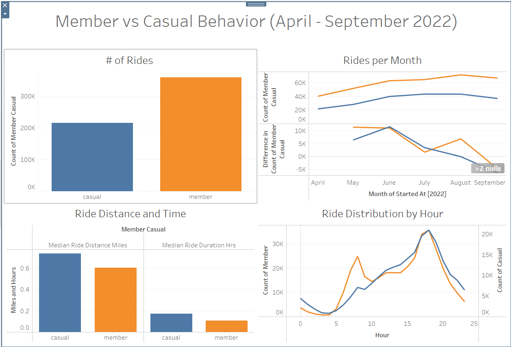

# Citi Bike Analysis

Citi Bike is a bike sharing company with operations in New York. Data from 2013 to present is publicly available on their website. For this bootcamp project, a Tableau dashboard was constructed to visualize data from April to September 2022. 

Tableau Public Link: https://public.tableau.com/app/profile/joey.eikens/viz/citi_bike_16663689497290/Story1?publish=yes

  

## Analysis

### Member vs Casual
Citi Bike offers riders the option to become members or casually use the service. Membership status is collected with every ride. The dataset was segregated to analyzed differences in behavior between members and casual riders. During the time period studied, more member rides than casual rides occured (358,481 vs 214,492). The two groups also showed differences in how they used the bikes. For example, casual users road the bikes farther and longer on average than the members (median ride distance station to station: 0.7399 mi vs 0.6065 miles; median ride duration: 0.1714 vs 0.1089 hrs). The most striking difference however, is in the time of day that member and casual riders utilize the Citi Bike service. The Ride Distribution by Hour plot shows that both groups ride most at 6 pm. Members also show a sharp spike in usage around 8 am, whereas there is only a slight uptick in usage at this time in the casual group. A plausible explanation is that members are more likely to use the Citi Bike service as part of their morning commute.

### Electric vs Classic Bikes
Citi Bike offers two types of bikes, classic and electric. Despite the increased speed and lower physical exertion required to ride an electric bike, classic and electric bikes are utilized in very similar ways. Electric bikes are typically road slightly farther (median ride distance station to station: 0.7249 vs 0.6173 miles) and the ride duration is essentially equivalent between both bike types (0.1200 vs 0.1322 hrs). Additionally, both bikes are utilized similarly throught the day with spikes in usage occuring at 8 am and 5-6 pm.

### Station Popularity 
To assess station popularity, the top 10 stations where customers started and ended their rides were ranked ranked in descending order. The top seven stations are the same between the starting and stopping stations. Two maps were created to visualize the distribution of start and end station popularity throughout the city. The maps confirm that there is no difference between starting and ending station popularity among stations. 

## Data Cleaning
Data cleaning was performed using Python in cleaning.ipynb. Each month of data was combined into a composite csv file for analysis. Additionally, ride duration and the station to station distance were calculated for each ride. The final cleaned data is available in 2204-2209_clean.csv.
